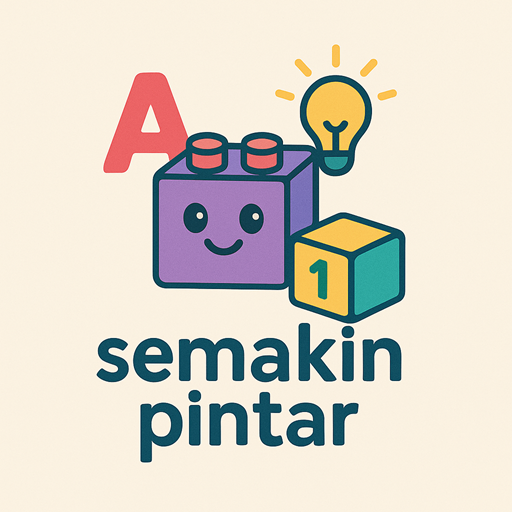

# 🧠 Semakin Pintar - Educational Games Platform

<div align="center">



**Free educational games for kids & family learning**

[](https://www.semakinpintar.com)
[](https://reactjs.org/)
[](https://www.typescriptlang.org/)
[](https://vitejs.dev/)
[](https://web.dev/progressive-web-apps/)

</div>

## 📖 About

Semakin Pintar is a comprehensive educational games platform designed to make learning math fun and engaging for children and families. The platform features interactive games that help improve mental arithmetic, pattern recognition, and cognitive skills through progressive difficulty levels.

### 🎮 Available Games

#### Math Games
- **Multiplication Table** - Interactive 1x1 to 10x10 multiplication practice
- **Mental Division** - Division practice with speech support
- **Mental Multiplication** - Advanced multiplication training
- **Patterns Detective** - Pattern recognition and computational thinking
- **Rocket Math** - Space-themed math adventure game
- **Mathcha Cafe** - Cafe-themed math practice with budgeting scenarios
- **Math Drop** - Puyo Puyo-style puzzle game with math equations and special power-ups
- **Math Flip** - Memory card matching game pairing math equations with their answers

#### Cognitive Skills
- **Sort Attack** - Sort scrambled numbers using only adjacent swaps before time runs out
- **Pair Shift** - Pick any two adjacent cards and slide them as a pair to sort in minimum moves

#### Brain Training
- **Mirror Dash** - Control two ships at once across mirrored lanes! Navigate both sides simultaneously — dodge obstacles, grab power-ups, and make split-second decisions
- **Stack Climber** - Jump on blocks that follow the current number rule to launch yourself higher; wrong blocks cost a life while fall speed increases as you climb

## ✨ Features

- 📱 **Progressive Web App (PWA)** - Install on any device, works offline
- 🎯 **Adaptive Difficulty** - Games adjust to player skill level
- 🔊 **Audio Support** - Text-to-speech for accessibility
- 📊 **Progress Tracking** - Monitor learning progress and achievements
- 🌐 **SEO Optimized** - Rich structured data and meta tags
- 📱 **Mobile First** - Responsive design for all screen sizes
- 🎨 **Modern UI** - Clean, intuitive interface with Tailwind CSS
- 📈 **Analytics** - Google Analytics integration for insights

## 🚀 Quick Start

### Prerequisites

- Node.js 18+ 
- npm or yarn

### Installation

1. **Clone the repository**
   ```bash
   git clone https://github.com/semakinpintar/semakin-pintar.git
   cd semakin-pintar
   ```

2. **Install dependencies**
   ```bash
   npm install
   ```

3. **Set up environment variables**
   ```bash
   cp .env.example .env
   ```
   
   Update the `.env` file with your configuration:
   ```env
   VITE_SUPABASE_URL=your_supabase_url
   VITE_SUPABASE_ANON_KEY=your_supabase_anon_key
   ```

4. **Start development server**
   ```bash
   npm run dev
   ```

5. **Open your browser**
   Navigate to `http://localhost:5173`

## 🛠️ Development

### Available Scripts

| Command | Description |
|---------|-------------|
| `npm run dev` | Start development server (port 5173) |
| `npm run build` | Build for production |
| `npm run lint` | Run ESLint code analysis |
| `npm run preview` | Preview production build (port 4173) |

### Project Structure

```
src/
├── components/           # React components
│   ├── games/           # Game-specific components
│   ├── layout/          # Layout components
│   └── ui/              # Reusable UI components
├── hooks/               # Custom React hooks
├── utils/               # Utility functions
│   ├── analytics.ts     # Google Analytics setup
│   └── supabase.ts      # Supabase client
├── App.tsx              # Main application component
└── main.tsx             # Application entry point

public/
├── icons/               # PWA icons and favicons
├── audio/               # Game audio files
└── images/              # Static images

supabase/
├── patterns-detective-ddl.sql  # Database schema
└── patterns-detective-data.sql # Sample data
```

## 🔧 Technology Stack

- **Frontend**: React 19 with TypeScript
- **Build Tool**: Vite 6 with Hot Module Replacement
- **Styling**: Tailwind CSS + PostCSS
- **Routing**: React Router DOM v7
- **PWA**: Vite PWA Plugin with Workbox
- **Database**: Supabase (PostgreSQL)
- **Audio**: Tone.js for sound generation
- **Icons**: Lucide React
- **Analytics**: Google Analytics 4
- **Deployment**: Vercel

## 🌍 Environment Variables

| Variable | Description | Required |
|----------|-------------|----------|
| `VITE_SUPABASE_URL` | Supabase project URL | ✅ |
| `VITE_SUPABASE_ANON_KEY` | Supabase anonymous key | ✅ |

## 📦 Building for Production

```bash
# Build the application
npm run build

# Preview the build locally
npm run preview
```

The build process:
1. Compiles TypeScript
2. Bundles with Vite
3. Generates PWA service worker
4. Creates optimized chunks for better loading
5. Generates sitemap automatically

## 🚀 Deployment

### Vercel (Recommended)

1. Connect your GitHub repository to Vercel
2. Set environment variables in Vercel dashboard
3. Deploy automatically on every push to main branch

### Manual Deployment

```bash
npm run build
# Upload dist/ folder to your hosting provider
```

## 🤝 Contributing

We welcome contributions! Please follow these steps:

1. Fork the repository
2. Create a feature branch (`git checkout -b feature/amazing-feature`)
3. Commit your changes (`git commit -m 'Add amazing feature'`)
4. Push to the branch (`git push origin feature/amazing-feature`)
5. Open a Pull Request

### Development Guidelines

- Follow TypeScript strict mode
- Use Tailwind CSS for styling
- Ensure mobile responsiveness
- Add proper TypeScript types
- Include JSDoc comments for complex functions
- Test PWA functionality before submitting

## 📄 License

This project is licensed under the MIT License - see the [LICENSE](LICENSE) file for details.

## 🙋‍♂️ Support

- 🌐 **Website**: [semakinpintar.com](https://www.semakinpintar.com)
- 📧 **Email**: ricardoalexanderh@gmail.com
- 🐛 **Issues**: [GitHub Issues](https://github.com/semakinpintar/semakin-pintar/issues)

## 🙏 Acknowledgments

- React team for the amazing framework
- Vite team for the lightning-fast build tool
- Supabase for the backend infrastructure
- All contributors and users who make this project possible

---

<div align="center">
Made with passion by Ricardo Alexander
</div>
